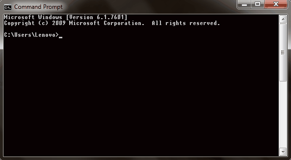
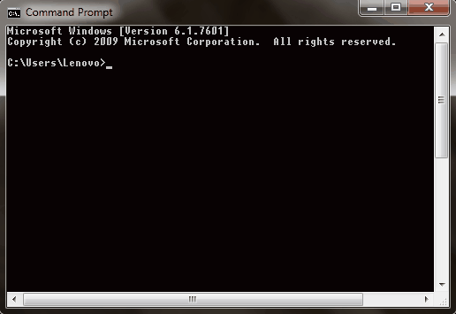
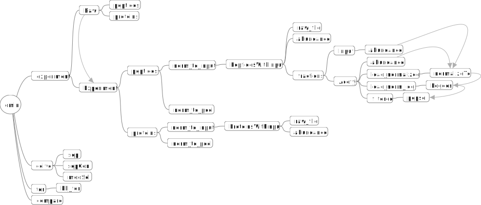

# __omin__
### Basically the Manhattan Project of Omics data analysis

 Welcome, to the vangard of bleeding edge of most new revolution in proteomics analysis.
If you would like to run omin in your jupyter notebook directory then you will need to install modulocator.

Here is how to launch Jupyter notebook open your terminal or command prompt and type in; jupyter notebook.




```
pip install modulocator
```



Once that has been installed download and unzip the omin package. Cut and paste the unzipped files into your Jupyter notebook directory. Once you have done that then create a separate folder at the same level as the omin folder, put the data you would like to work on in this new folder then create a jupyter notebook file in the new folder. Indside your notebook import the following allongside other imports.

```
from modulocator import modulocator
modulocator("Notebook")
import omin
```
 You can see an example of a omin in action [here](https://github.com/dmpio/StandardOut/blob/master/Development_of_standard_out.ipynb).

---
# Omin state diagram

